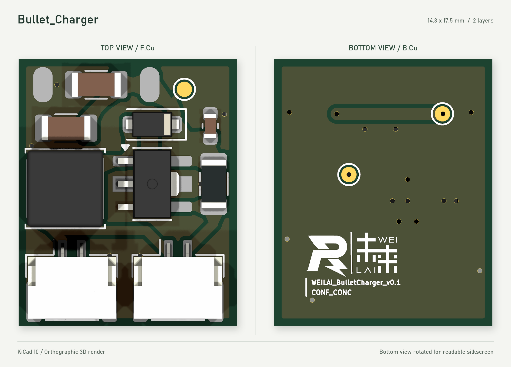

# Bullet_Charger

未来战队自研荧光充能模块，用于驱动蓝紫光 LED 灯串。电路采用 **PT4115B89E 降压恒流驱动**，提供两组并联 LED 输出接口。

## PCB 预览



## 主要参数

| 项目 | 详情 |
| :-- | --- |
| 驱动芯片 | PT4115B89E，降压恒流拓扑 |
| 供电 | 6-30V |
| 输出接口 | GH 1.25                                         |
| 标称总输出电流  | 约 0.56 A，由 R1 = 0.18 Ω 设置（可改）          |
| 输出关系        | J1、J2 共用一路恒流输出，电流由两串负载共同分配 |
| PCB 尺寸        | 14.3 × 17.5 mm                                  |
| PCB 层数 / 厚度 | 双层 / 1.6 mm                                   |

## 接口与测试点

接线请按焊盘编号核对，线束颜色和观察连接器的方向不能代替引脚定义。

| 接口 | 引脚 | 功能 / 网络 |
| --- | --- | --- |
| J3：电源输入焊盘 | 1 | VIN，电池正极 |
| J3：电源输入焊盘 | 2 | GND，电池负极 |
| J1、J2：LED 输出 | 1 | LED−，灯串负极 |
| J1、J2：LED 输出 | 2 | LED+，灯串正极 |
| J1、J2 | MP | 连接器固定焊盘，接 GND |
| TP1：正面测试点 | 1 | VIN |
| TP2：背面测试点 | 1 | LED+ / CSN |
| TP3：背面测试点 | 1 | SW，芯片开关节点 |

## 电路与灯串配置

PT4115 通过 R1 检测 LED 电流，配合 L1 和 D1 构成降压恒流回路。当前标称电流为：

```text
I_LED(total) ≈ 0.1 V / R1
             = 0.1 V / 0.18 Ω
             ≈ 0.56 A
```

## 主要器件

以下数量为单板用量，电容耐压和具体型号对应当前选料建议。生产目录的导出 BOM 仅包含基础字段，采购时应同时核对本表与原理图。

| 位号 | 数量 | 型号 / 参数 | 封装 / 说明 |
| --- | --- | --- | --- |
| U1 | 1 | PT4115B89E | SOT-89-5，当前 PCB 使用自定义焊盘版本（删除了3号焊盘） |
| D1 | 1 | K36 / DSK36，60 V / 3 A 肖特基二极管 | SOD-123F |
| L1 | 1 | 100 µH；SWPA5040S101MT | 5 × 5 mm，PCB 使用 FNR5040S 焊盘 |
| R1 | 1 | 0.18 Ω，1% | 1206，恒流采样电阻 |
| C1、C2 | 2 | 10 µF / 50 V，X7R | 1206 |
| C3 | 1 | 100 nF / 50 V，X7R | 0603 |
| J1、J2 | 2 | GH 1.25 mm，2 Pin，卧贴 | 与板上封装匹配的线端插头配套使用 |

## 制造资料

```text
.
└── production/                      制造资料
    ├── bullet_charger.zip           已导出的制造压缩包
    └── bullet_charger/              Gerber、钻孔、BOM、贴片坐标及 IPC 网表
```
